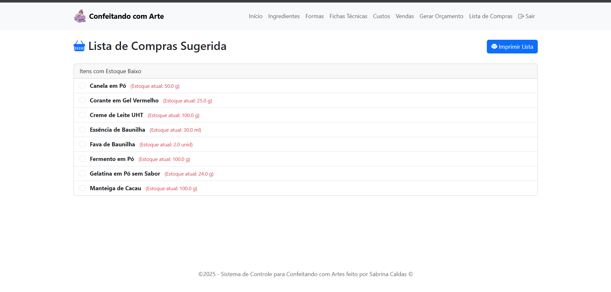
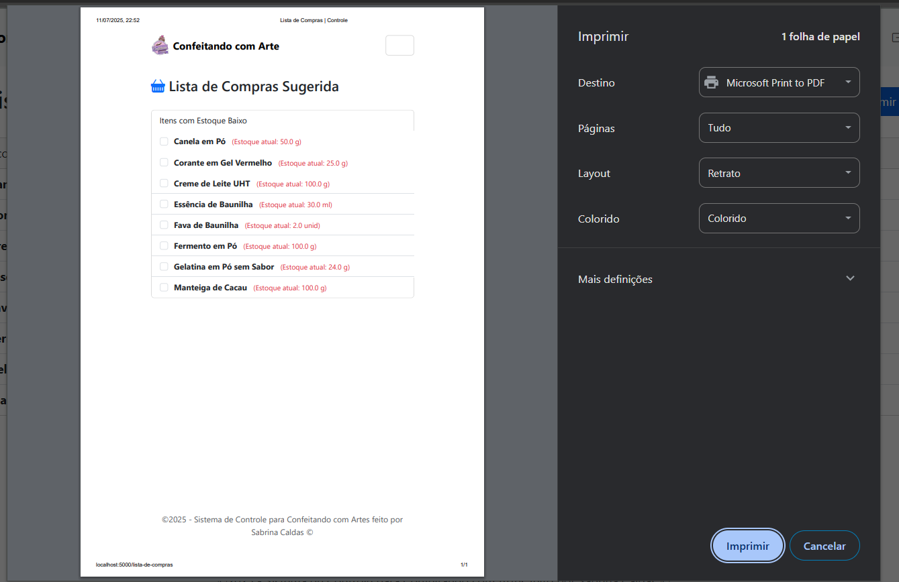
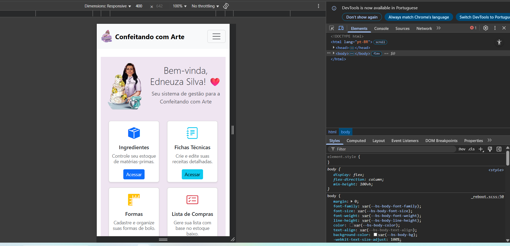

# 🍰 Confeitando com Arte - Sistema de Gestão

Sistema de gestão completo desenvolvido em Python com o framework Flask. O objetivo é fornecer uma ferramenta robusta e intuitiva para confeiteiras gerenciarem seus custos, receitas, estoque e vendas, transformando dados em decisões inteligentes para o negócio.

---

### 📸 Demonstração Visual (Telas do Sistema)

Uma visão geral das principais telas e funcionalidades da aplicação.

---

**1. Painel Principal (Dashboard)**
*Visão geral do negócio com indicadores chave, alertas de estoque e gráfico dos principais ingredientes.*


---

**2. Gestão de Custos**
*Tela para configuração do custo da hora de trabalho, base para o cálculo de mão de obra nas receitas.*


---

**3. Gerenciamento de Ingredientes**
*Controle total do estoque, com alertas visuais, custo médio e acesso rápido para registrar novas compras.*


---

**4. Gerenciamento de Formas**
*Cadastro e edição das formas utilizadas nas produções.*


---

**5. Fluxo Completo de Fichas Técnicas**
*Criação, detalhamento, composição de custos e precificação final de cada receita.*


* * *


* * *


---

**6. Exportação para Excel**
*Funcionalidade para exportar os detalhes completos da ficha técnica para uma planilha Excel.*


---

**7. Painel de Vendas**
*Registro de novas vendas e acompanhamento do histórico com Faturamento, Custo e Lucro Total.*


---

**8. Geração de Orçamentos**
*Formulário intuitivo para criação de orçamentos detalhados, que são convertidos para um PDF profissional.*


* * *


---

**9. Lista de Compras Inteligente**
*O sistema gera uma lista de compras automática baseada no estoque baixo e oferece uma versão limpa para impressão.*



* * *



---

---

**10. Versão Mobile**
*O sistema é totalmente responsivo, adaptando-se a telas de celulares para gestão em qualquer lugar.*



---

### 🚀 Como Executar o Projeto Localmente

Siga os passos abaixo para configurar e rodar a aplicação no seu ambiente local.

**1. Pré-requisitos**
* Python 3.x
* Git

**2. Clonar o Repositório**
```bash
git clone [https://github.com/biinahc/gestao-confeitaria-flask.git](https://github.com/biinahc/gestao-confeitaria-flask.git)
cd gestao-confeitaria-flask

**3. Criar e Ativar o Ambiente Virtual**
Bash
# Windows
python -m venv venv
venv\Scripts\activate
# macOS / Linux
python3 -m venv venv
source venv/bin/activate

4. Instalar as Dependências
Bash
pip install -r requirements.txt
(Se você não tiver um arquivo requirements.txt, crie-o com o comando: pip freeze > requirements.txt)

5. Configurar o Banco de Dados
Este processo cria um banco de dados limpo e prepara o sistema de migrações para o futuro.
Bash
# Cria a pasta de migrações (execute apenas uma vez na vida do projeto)
flask db init
# Gera o primeiro script de migração a partir dos seus modelos
flask db migrate -m "Migração inicial do banco de dados"
# Aplica a migração para criar o banco de dados e suas tabelas
flask db upgrade

6. Criar o Usuário Administrador
O banco de dados será criado vazio. Use o comando abaixo para criar seu primeiro usuário.
Bash
flask create-user
(O terminal irá pedir para você digitar um nome de usuário e uma senha).

7. Executar a Aplicação
Bash
flask run
Abra seu navegador e acesse http://127.0.0.1:5000

🛠️ Tecnologias Utilizadas
Backend: Python, Flask, SQLAlchemy, Flask-Login, Flask-Migrate
Frontend: HTML5, CSS3, Bootstrap 5, JavaScript
Banco de Dados: SQLite (para desenvolvimento)
Geração de PDF: WeasyPrint
Geração de Excel: OpenPyXL


Feito com ❤️ para a melhor sogra e confeiteira!
